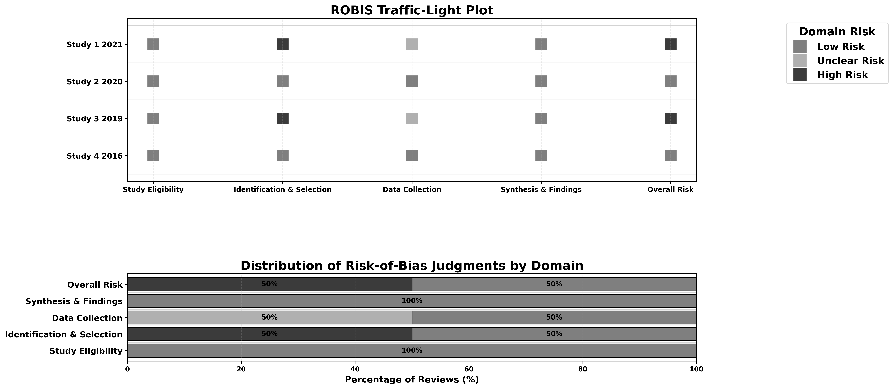
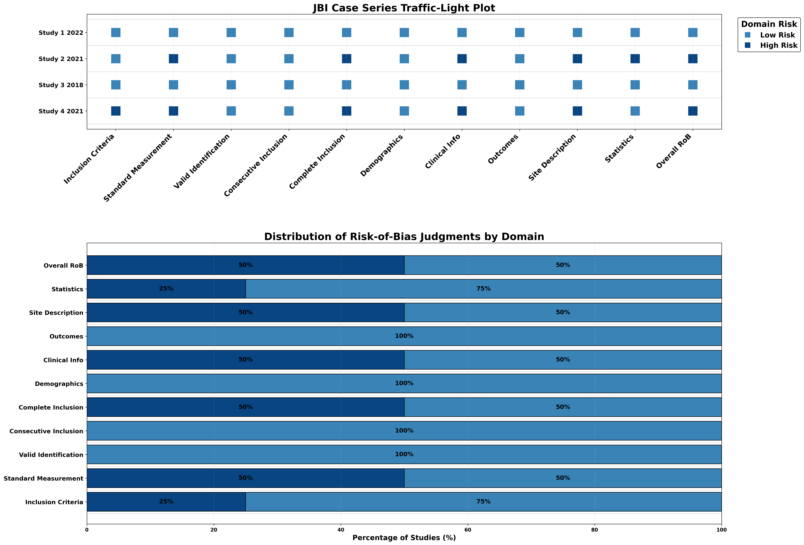

# Critiplot

[](https://www.python.org/)
[](https://opensource.org/licenses/Apache-2.0)
[](https://doi.org/10.5281/zenodo.17236600)

**Critiplot** is an open-source Python tool and **interactive web app** for **visualizing risk-of-bias (RoB) assessments** across multiple evidence synthesis tools:

* **Newcastle-Ottawa Scale (NOS)**
* **JBI Critical Appraisal Checklists** (Case Report / Case Series)
* **GRADE certainty of evidence**
* **ROBIS for systematic reviews**

It produces **publication-ready traffic-light plots** and **stacked bar charts**, allowing researchers to summarize study quality clearly in systematic reviews and meta-analyses.

🔗 **Interactive web app:** [critiplot.vercel.app](https://critiplot.vercel.app)

📂 **Code & archive (Zenodo DOI):** [10.5281/zenodo.17065215](https://doi.org/10.5281/zenodo.17065215)

---

## ✨ Key Features

* Converts risk-of-bias ratings into **traffic-light plots**.
* Generates **publication-quality figures** in multiple formats: `.png`, `.pdf`, `.svg`, `.eps`.
* Supports **NOS, JBI (Case Report / Case Series), GRADE, and ROBIS**.
* Open-source, fully reproducible, usable via **Python scripts** or **Streamlit web app**.
* Adjustable **themes, figure sizes, line thickness, and legends**.

---


## 📥 Installation

```bash
git clone https://github.com/aurumz-rgb/Critiplot-main.git
cd Critiplot
pip install -r requirements.txt
```

> Tested with **Python 3.10+**, **Matplotlib**, **Seaborn**, and **Pandas**.

---

## ⚡ Usage

### 1️⃣ Python Scripts

Separate scripts are available for each assessment tool:

| Script                    | Input                    | Output          | Notes                                             |
| ------------------------- | ------------------------ | --------------- | ------------------------------------------------- |
| `nos_plot.py`             | NOS CSV/XLSX             | PNG/PDF/SVG/EPS | Traffic-light & stacked bar plots for NOS studies |
| `jbi_case_report_plot.py` | JBI Case Report CSV/XLSX | PNG/PDF/SVG/EPS | For individual case reports                       |
| `jbi_case_series_plot.py` | JBI Case Series CSV/XLSX | PNG/PDF/SVG/EPS | For case series studies                           |
| `grade_plot.py`           | GRADE CSV/XLSX           | PNG/PDF/SVG/EPS | Summarizes certainty of evidence                  |
| `robis_plot.py`           | ROBIS CSV/XLSX           | PNG/PDF/SVG/EPS | Summarizes systematic review risk-of-bias         |

#### Example Commands

```bash
# NOS
python3 nos_plot.py nos_data.csv nos_plot.png
python3 nos_plot.py nos_data.xlsx nos_plot.png

# JBI Case Report
python3 jbi_case_report_plot.py case_report.csv report_plot.png
python3 jbi_case_report_plot.py case_report.xlsx report_plot.png

# JBI Case Series
python3 jbi_case_series_plot.py case_series.csv series_plot.png
python3 jbi_case_series_plot.py case_series.xlsx series_plot.png

# GRADE
python3 grade_plot.py grade_data.csv grade_plot.png
python3 grade_plot.py grade_data.xlsx grade_plot.png

# ROBIS
python3 robis_plot.py robis_data.csv robis_plot.png
python3 robis_plot.py robis_data.xlsx robis_plot.png
```

---

> Optional `[theme]` argument for **NOS, JBI Case Report / Case Series, and ROBIS**:
> `"default"`, `"blue"`, `"gray"`, `"smiley"`, `"smiley_blue"`
>
> ⚠️ **Note:** For **GRADE**, these themes are not available. Instead, GRADE supports:
> `"default"`, `"green"`, `"blue"`

**Example Usage:**

```bash
# NOS
python3 nos_plot.py nos_data.csv nos_plot.png smiley_blue

# ROBIS
python3 robis_plot.py robis_data.xlsx robis_plot.png blue

# GRADE (only default/green/blue)
python3 grade_plot.py grade_data.csv grade_plot.png green
```

> If the theme argument is omitted, the **default** theme will be used.

---

### 2️⃣ Streamlit Web App

```bash
streamlit run app.py
```

* Upload your CSV/XLSX file to visualize **traffic-light plots**.
* Select the **risk-of-bias tool**: NOS, JBI, GRADE, or ROBIS.
* Choose your **plot theme** for a publication-ready figure.
* Download plots in **PNG, PDF, SVG, or EPS formats** directly.

> The web provides **example CSV/XLSX templates** for each tool to guide formatting.

---

## 📖 Methods Notes

* **RoB assessment:** Follows the original scoring/checklists of each tool.
* **Visualisation:** Traffic-light and weighted bar plots generated with **Matplotlib / Seaborn**.
* **Transparency:** Raw scores should be included in supplementary tables.
* **Reproducibility:** Code and sample datasets archived via **Zenodo DOI**.
* **Scope:** Critiplot is a **visualisation tool only**; it does **not compute risk-of-bias**.

---

## 🔹 How Scores Are Converted to Risk-of-Bias (RoB)

### NOS

* **Selection domain (0–4 stars):** 3–4 → Low, 2 → Moderate, 0–1 → High
* **Comparability domain (0–2 stars):** 2 → Low, 1 → Moderate, 0 → High
* **Outcome/Exposure domain (0–3 stars):** 3 → Low, 2 → Moderate, 0–1 → High

### JBI

* Each domain is binary: `1 = low risk`, `0 = high risk` (case reports & series).

### GRADE

* High / Moderate / Low / Very Low certainty mapped to traffic-light colors.

### ROBIS

* Domains evaluated as Low / High / Unclear risk and visualized similarly.

---

## Critiplot


---

## 📸 Example / Result
Here’s an example traffic-light plot generated using Critiplot using different themes.


NOS


GRADE



ROBIS


JBI Case Report



JBI Case Series


---

## 📄 Citation

If you use **Critiplot** in your work, please cite:

**APA:**

> Sahu, V. (2025). *Critiplot: A Critical Appraisal Plot Visualiser for Risk of Bias in Systematic Reviews and Meta-Analyses (v1.0.1)*. (https://doi.org/10.5281/zenodo.17236600)

**Other formats:**

Harvard, MLA, Chicago, IEEE, Vancouver (see full web for options).

> Download RIS/BibTeX citation files directly from the web.

---

## 📜 License

Apache 2.0 © 2025 Vihaan Sahu

