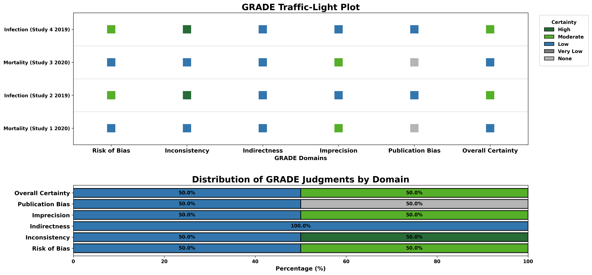
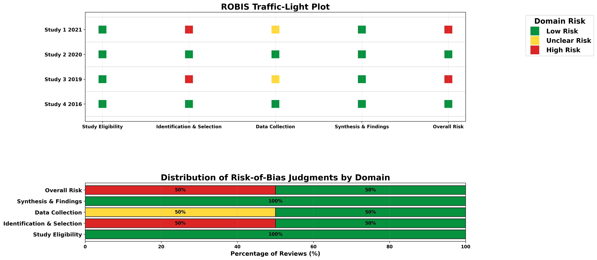
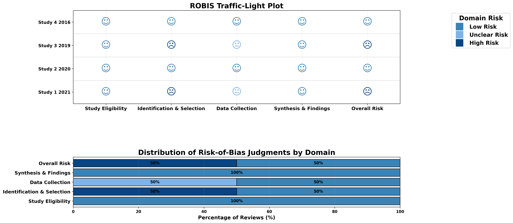
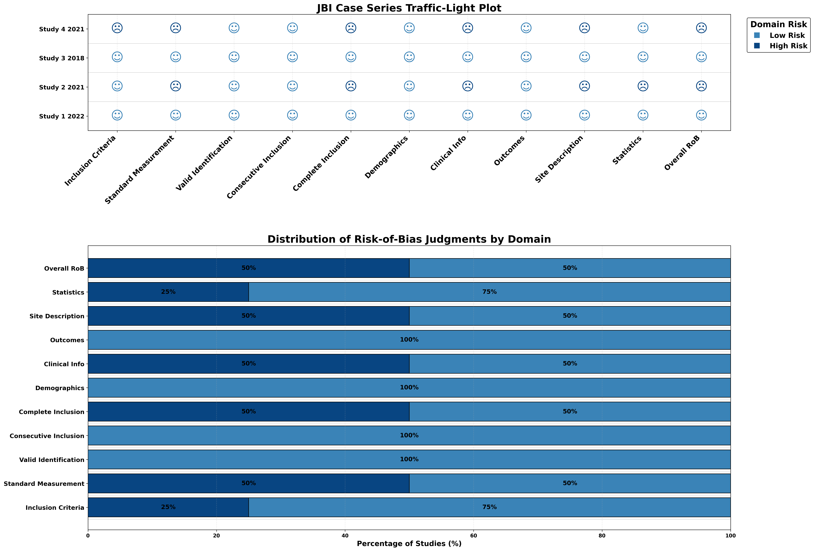

# Summary

**Critiplot** is an open-source Python package designed to **visualize risk-of-bias (RoB) assessments** in systematic reviews and meta-analyses. Risk-of-bias evaluation is a cornerstone of evidence synthesis, as it allows researchers to assess the reliability of published studies. Traditionally, generating visual summaries of study quality required significant manual work and expertise in data visualization.

Critiplot automates this process by producing **publication-ready traffic-light plots** and **stacked bar charts** that summarize study quality across multiple RoB tools. The software supports commonly used tools including:

* **Newcastle–Ottawa Scale (NOS)** – for cohort and case-control studies  
* **ROBIS** – for systematic reviews  
* **JBI Critical Appraisal Checklists** – Case Series and Case Reports  
* **GRADE** – for certainty of evidence in systematic reviews  

By enabling reproducible and transparent visual summaries, Critiplot allows researchers, guideline developers, and meta-analysts to **communicate study quality clearly to both specialists and non-specialists**.

# Statement of need

Systematic reviews and meta-analyses rely on structured evaluations of study quality to draw reliable conclusions. Tools such as NOS, ROBIS, JBI, and GRADE provide detailed frameworks to assess bias, but the creation of visual summaries is often **manual, inconsistent, and time-consuming**. Existing solutions either require extensive coding knowledge or are limited in flexibility and customization.

**Critiplot addresses these gaps** by providing:

* A **Python-native, reproducible plotting framework**  
* Support for multiple RoB assessment tools  
* **Traffic-light visualizations** that are interpretable at a glance  
* Customizable themes for publication-quality aesthetics  
* Easy integration with Python-based workflows  

Researchers can therefore **quickly generate high-quality figures**, standardize reporting across projects, and reduce errors introduced by manual figure creation. Critiplot is suitable for **meta-research, clinical guideline development, and teaching evidence-based medicine**, making it broadly useful in research workflows.

# Dependencies

Critiplot requires Python 3.11 and relies on:

* **NumPy** [@numpy]  
* **Pandas** [@pandas]  
* **Matplotlib** [@matplotlib]  
* **Seaborn** [@seaborn]  
* **PyArrow** [@pyarrow]  
* **Openpyxl** [@openpyxl]  

These packages ensure fast, reliable processing and plotting of RoB data from CSV or Excel sources.

# Themes

Critiplot supports a variety of themes that modify the color palette and style of plots. Each theme automatically adjusts traffic-light colors and figure aesthetics for better publication compatibility.

| Tool / Assessment   | Available Themes                                             | Description                                                       |
| ------------------- | ------------------------------------------------------------ | ----------------------------------------------------------------- |
| **NOS, JBI, ROBIS** | `"default"`, `"blue"`, `"gray"`, `"smiley"`, `"smiley_blue"` | Traffic-light palettes and neutral tints for medical publications |
| **GRADE**           | `"default"`, `"green"`, `"blue"`                             | Confidence or certainty scales (green preferred)                  |

Each plotting function accepts a `theme` argument. If no theme is specified, the **default theme** is applied automatically.

# Input Data Examples

### ROBIS

| Review   | Study Eligibility Criteria | Identification & Selection | Data Collection & Study Appraisal | Synthesis & Findings | Overall RoB |
| -------- | ------------------------- | ------------------------- | -------------------------------- | ------------------ | ----------- |
| Study 1 2021 | Low | High | Unclear | Low | High |
| Study 2 2020 | Low | Low | Low | Low | Low |
| Study 3 2019 | Low | High | Unclear | Low | High |
| Study 4 2016 | Low | Low | Low | Low | Low |

### NOS

| Author, Year | Representativeness | Non-exposed Selection | Exposure Ascertainment | Outcome Absent at Start | Comparability (Age/Gender) | Comparability (Other) | Outcome Assessment | Follow-up Length | Follow-up Adequacy | Total Score | Overall RoB |
| ------------ | ---------------- | ------------------- | ------------------- | ------------------- | ---------------------- | ------------------- | ---------------- | ---------------- | ----------------- | ---------- | ----------- |
| Study 1, 2019 | 1 | 1 | 1 | 1 | 1 | 0 | 1 | 1 | 1 | 8 | Low |
| Study 2, 2024 | 1 | 1 | 1 | 1 | 1 | 0 | 1 | 1 | 0 | 7 | Moderate |
| Study 3, 2019 | 1 | 0 | 1 | 1 | 0 | 1 | 1 | 0 | 1 | 6 | Moderate |

### JBI Case Series

| Author | Year | InclusionCriteria | StandardMeasurement | ValidIdentification | ConsecutiveInclusion | CompleteInclusion | Demographics | ClinicalInfo | Outcomes | SiteDescription | Statistics | Total | Overall RoB |
| ------ | ---- | ---------------- | ----------------- | ----------------- | ------------------ | ---------------- | ----------- | ------------ | -------- | --------------- | ---------- | ----- | ----------- |
| Study 1 | 2022 | 1 | 1 | 1 | 1 | 1 | 1 | 1 | 1 | 1 | 1 | 10 | Low |
| Study 2 | 2021 | 1 | 0 | 1 | 1 | 0 | 1 | 0 | 1 | 0 | 0 | 5 | High |

### JBI Case Report

| Author | Year | Demographics | History | ClinicalCondition | Diagnostics | Intervention | PostCondition | AdverseEvents | Lessons | Total | Overall RoB |
| ------ | ---- | ----------- | ------- | ---------------- | ----------- | ------------ | ------------- | ------------- | ------- | ----- | ----------- |
| Study 1 | 2022 | 1 | 1 | 0 | 1 | 1 | 1 | 1 | 1 | 7 | Low |
| Study 2 | 2021 | 1 | 0 | 0 | 1 | 0 | 0 | 0 | 1 | 3 | High |

### GRADE

| Outcome | Study | Risk of Bias | Inconsistency | Indirectness | Imprecision | Publication Bias | Overall Certainty |
| ------- | ----- | ------------ | ------------- | ----------- | ----------- | ---------------- | ---------------- |
| Mortality | Study 1 2020 | Low | Low | Low | Moderate | None | Low |
| Infection | Study 2 2019 | Moderate | High | Low | Low | Low | Moderate |

# Figures

  

Below are example visualizations generated by Critiplot with different themes:

## NOS Visualizations


## GRADE Visualizations





## ROBIS Visualizations







## JBI Case Report Visualizations


## JBI Case Series Visualizations




These figures demonstrate the variety of visualizations Critiplot can generate for different risk-of-bias assessment tools and themes.

# Acknowledgements

The author acknowledges open-source software developers whose contributions underpin Critiplot. No external funding was used in this work.

# References

Cite like:

```markdown
[@nos; @jbi; @robis; @grade; @python; @numpy; @pandas; @matplotlib; @seaborn; @pyarrow; @openpyxl]